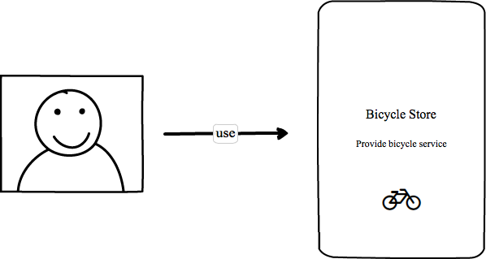
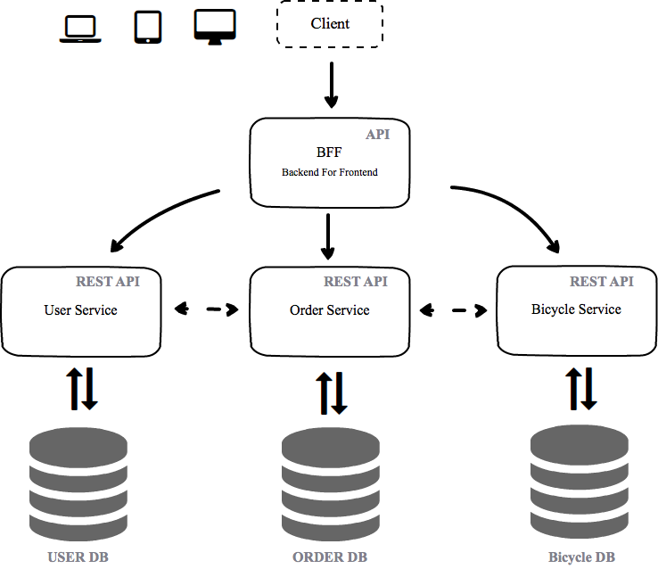
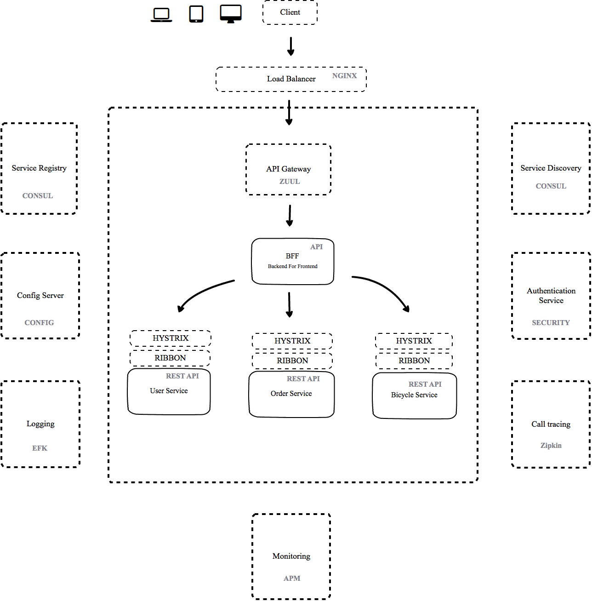
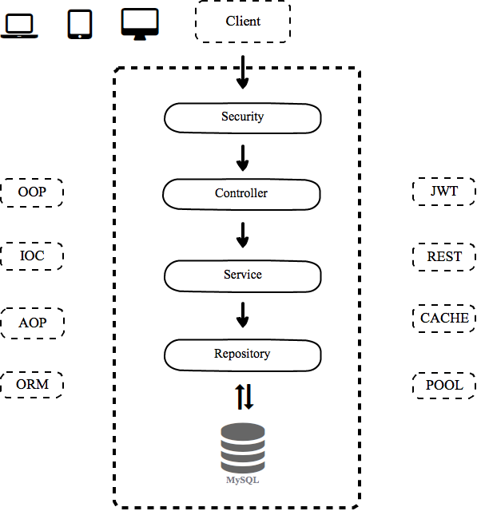
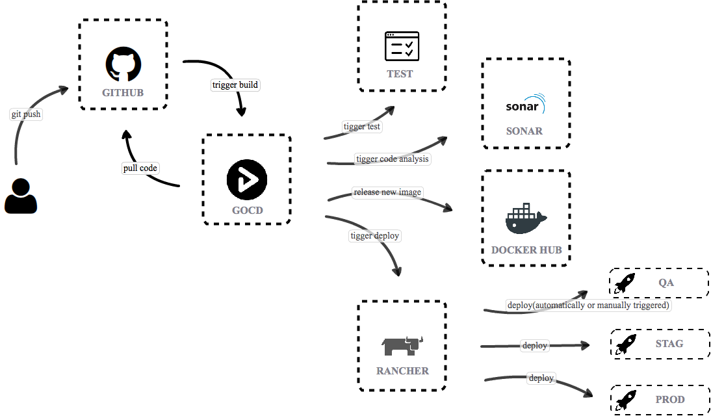

# `微服务架构`刻意练习的项目

## 目录

- [架构图](#架构图)
    - [系统全景图](#系统全景图)
    - [业务相关服务](#业务相关服务)
    - [基础设施服务](#基础设施服务) 
    - [微服务模板](#微服务模板)
    - [持续集成/持续交付架构图](#持续集成/持续交付架构图)
- [知识点](#知识点)
    - [微服务架构入门](#微服务架构入门)
    - [微服务应用层架构](#微服务应用层架构)
    - [持续集成/交付/部署](#持续集成/交付/部署) 
    - [微服务运维-基础设施服务](#微服务运维-基础设施服务)
    - [微服务安全策略](#微服务安全策略)

## 架构图

### 系统全景图
> 

### 业务相关服务

* BFF: 用于聚合其它服务提供的 API 服务，给前端提供高效可用的 API。
* User Service: 用户相关服务，比如：获取用户相关信息。 
* Order Service: 订单 CRUD 服务。
* Bicycle Service: 自行车商品相关服务。

> 

### 基础设施服务
基础设施服务：服务网关，服务发现，服务注册，服务监控等。

> 

### 微服务模板
单个微服务应用架构，按照 request 处理的生命周期展开。
> 

### 持续集成/持续交付架构图

> 

## 知识点

### 微服务架构入门
 * [什么是微服务](./what-is-microservice.md)
 * [微服务拆分](./microservice-split.md)

### 微服务应用层架构
 * [resetful](resetful)
 * [配置管理](配置管理)
 * [代码规范](代码规范)
 * [测试策略](测试策略)

### 持续集成/交付/部署
 * GoCD/Jenkins
 * Rancher
 * 蓝绿部署
 
### 微服务运维-基础设施服务
 * 服务发现
 * 服务注册
 * 配置管理
 * API 网关
 * 负载均衡
 * 日志管理
 * 性能监控

### 微服务安全策略
 *